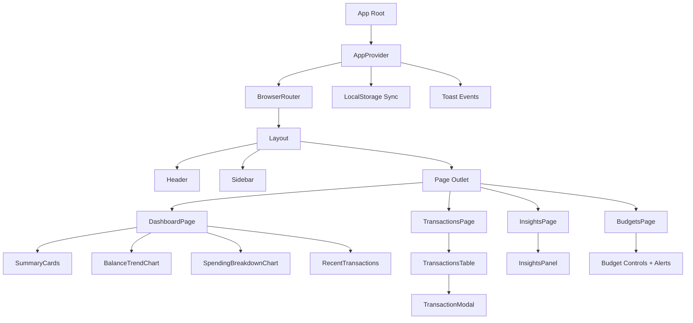
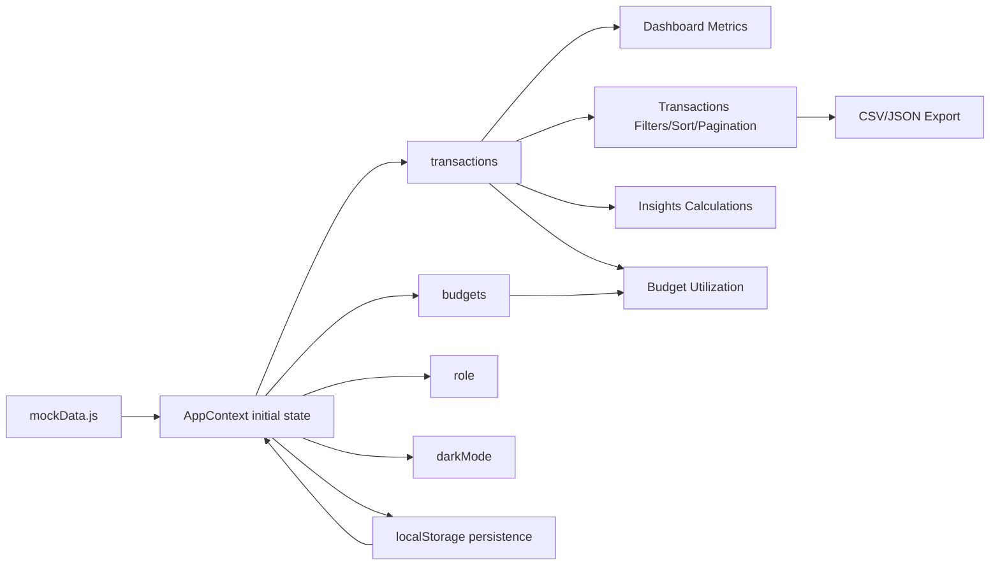
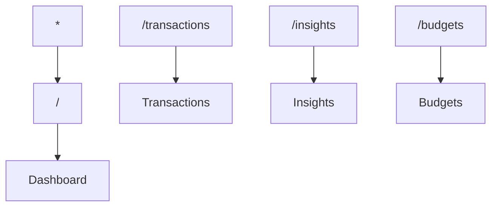
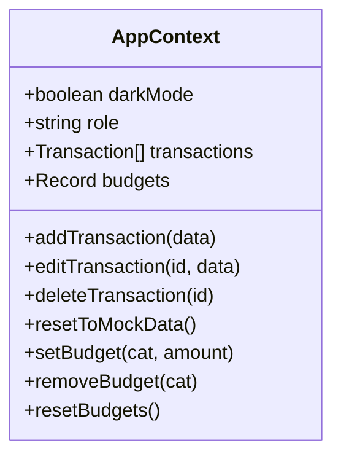

# FinTrack: Personal Finance Dashboard

FinTrack is a frontend finance dashboard application for tracking transactions, visualizing trends, managing budgets, and generating data-driven insights.

It runs fully on the client side using seeded transaction data and persists user changes in localStorage.

---

## Features

### Dashboard
- KPI summary cards (balance, income, expenses, savings trend)
- Balance trend chart
- Spending breakdown chart
- Recent transactions panel

### Transactions
- Search (description, merchant, category)
- Filters (type, category, date range)
- Sorting (date, description, category, type, amount)
- Pagination
- Admin-only add, edit, delete
- Export filtered data as CSV or JSON

### Insights
- Highest spending category
- Month-over-month spending comparison
- Contextual observation text generated from current data

### Budgets
- Per-category budget setup
- Budget progress and threshold alerts
- Edit/remove/reset budget controls

### UX
- Responsive layout (mobile/tablet/desktop)
- Dark mode with persistence
- Toast notifications for CRUD operations
- Role-based UI behavior (Admin / Viewer)

---

## System Design

### Runtime Layers
- Presentation layer: route pages and reusable UI components.
- State layer: centralized app state and mutation API in context.
- Derivation layer: memoized selectors and chart-ready transformations.
- Persistence layer: localStorage hydration + write-through synchronization.

### Requestless Architecture

This application has no network dependency for core behavior.

- Initial state is hydrated from localStorage if available.
- Fallback is deterministic seeded data from [src/data/mockData.js](src/data/mockData.js).
- Every mutation writes through to localStorage so reloads preserve user state.

### Component Ownership

- [src/App.js](src/App.js): composition root, router map, global toaster.
- [src/context/AppContext.js](src/context/AppContext.js): source of truth for transactions, budgets, role, and theme.
- [src/pages/DashboardPage.jsx](src/pages/DashboardPage.jsx): KPI and chart orchestration.
- [src/components/TransactionsTable.jsx](src/components/TransactionsTable.jsx): query engine (search/filter/sort/page) + export controls.
- [src/pages/InsightsPage.jsx](src/pages/InsightsPage.jsx): derived analytics model for insights.
- [src/pages/BudgetsPage.jsx](src/pages/BudgetsPage.jsx): budget allocation and threshold alert logic.

---

## Architecture

### High-Level Component Architecture



### Data Flow



  ### Mutation Lifecycle

  ```mermaid
  sequenceDiagram
    participant UI as UI Component
    participant Ctx as AppContext
    participant LS as localStorage
    participant Toast as Toast System

    UI->>Ctx: add/edit/delete transaction
    Ctx->>Ctx: setState (immutable update)
    Ctx->>LS: persist updated state
    Ctx->>Toast: publish success/destructive message
    Ctx-->>UI: re-render via context subscription
  ```

### Route Map



---

## Tech Stack

| Layer | Technology |
|---|---|
| Framework | React 18 + React Router |
| Build | react-scripts |
| Styling | Tailwind CSS + CSS variables |
| UI Primitives | Radix UI + shadcn-style components |
| Charts | Chart.js + react-chartjs-2 |
| Icons | Lucide React |
| State | React Context API |
| Persistence | localStorage |

### Selected Dependencies and Roles

- `react-router-dom`: route segmentation and fallback route redirection.
- `chart.js` + `react-chartjs-2`: chart rendering with explicit registration via [src/chartSetup.js](src/chartSetup.js).
- `@radix-ui/*`: accessible primitives for dialog, toast, dropdown, tabs, etc.
- `class-variance-authority` + `tailwind-merge`: variant-based style composition for UI primitives.
- `jspdf` + `jspdf-autotable`: PDF export support through [src/utils/pdfExport.js](src/utils/pdfExport.js).

---

## State Model

Global state lives in [src/context/AppContext.js](src/context/AppContext.js).



Persistence strategy:
- Initialize from localStorage when available
- Fall back to seeded defaults
- Persist each slice on update

### Domain Entities

`Transaction`
- `id: string`
- `date: YYYY-MM-DD`
- `description: string`
- `amount: number`
- `category: string`
- `type: income | expense`
- `merchant?: string`

`Budgets`
- `Record<string, number>` mapped by expense category.

### Derived Metrics

Common derived values used across pages:
- `totalIncome = sum(amount where type=income)`
- `totalExpense = sum(amount where type=expense)`
- `netBalance = totalIncome - totalExpense`
- `savingsRate = (netBalance / totalIncome) * 100`
- month buckets via `date.substring(0, 7)` for trend and comparison views.

### Consistency Guarantees

- Context exposes mutation methods only; components do not mutate arrays directly.
- Updates are immutable (`map`, `filter`, spread).
- UI permissions are role-gated in rendering logic for admin actions.
- Toast feedback is emitted at mutation points for deterministic user feedback.

---

## Project Structure

```text
public/
  index.html
  favicon.ico
  favicon.svg

src/
  App.js
  App.css
  index.js
  index.css
  chartSetup.js

  components/
    Layout.jsx
    Header.jsx
    Sidebar.jsx
    BrandLogo.jsx
    SummaryCards.jsx
    BalanceTrendChart.jsx
    SpendingBreakdownChart.jsx
    RecentTransactions.jsx
    TransactionsTable.jsx
    TransactionModal.jsx
    InsightsPanel.jsx
    ui/
      ...reusable UI primitives

  context/
    AppContext.js

  pages/
    DashboardPage.jsx
    TransactionsPage.jsx
    InsightsPage.jsx
    BudgetsPage.jsx

  data/
    mockData.js

  hooks/
    use-toast.js

  utils/
    finance.js
    pdfExport.js
```

---

## Getting Started

### Prerequisites
- Node.js 18+
- npm 9+ (or Yarn 1.22+)

### Install and Run

```bash
npm install
npm start
```

App URL: http://localhost:3000

### Production Build

```bash
npm run build
```

### Optional Scripts

- `npm test`: launches test runner (if tests are added).

---

## Implementation Details

### Transactions Query Pipeline

The transactions table applies transformations in this order:

1. base dataset clone
2. text search filter
3. type/category/date filters
4. column sort
5. pagination slice

This order keeps behavior predictable and ensures export actions can target the filtered dataset directly.

### Insights Computation

[src/pages/InsightsPage.jsx](src/pages/InsightsPage.jsx) builds an `insights` object from current state using memoized transformations:

- category aggregation over expenses
- highest category selection by descending sum
- monthly expense rollup and latest/previous month extraction

This model is passed to [src/components/InsightsPanel.jsx](src/components/InsightsPanel.jsx), which is also defensively coded to tolerate empty/missing props.

### Budget Alert Logic

[src/pages/BudgetsPage.jsx](src/pages/BudgetsPage.jsx) computes utilization percentages and classifies states:

- `pct >= 100`: over budget
- `pct >= 80`: near threshold
- else: healthy

This same classification drives both visual tokens and summary alerts.

### Theme System

- Tailwind semantic tokens are mapped in [tailwind.config.js](tailwind.config.js).
- CSS variables are declared in [src/index.css](src/index.css).
- Theme is toggled by adding/removing `dark` class on `document.documentElement`.

---

## Performance Notes

- `useMemo` is used in high-churn views to avoid repeated heavy aggregations.
- Table pagination limits row rendering cost for large lists.
- Context state slices are simple and serializable, enabling inexpensive persistence.
- Chart configuration is centrally registered to reduce repeated setup overhead.

---

## Security and Data Considerations

- No secrets are required to run the app.
- Environment files are ignored via [.gitignore](.gitignore).
- localStorage is used only for non-sensitive application state.
- Exported files are generated client-side and never uploaded.

---

## Current Limitations

- Frontend-only persistence (no backend API)
- No auth service integration
- Export flow is browser-side only


## Next Improvements

- Add API-backed data and authentication
- Add automated unit/integration tests
- Add CI checks for lint/build/test
- Add advanced analytics (forecasting and anomaly detection)
