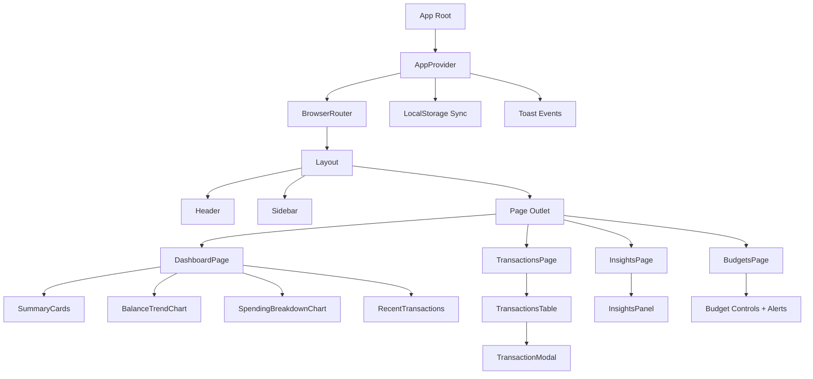
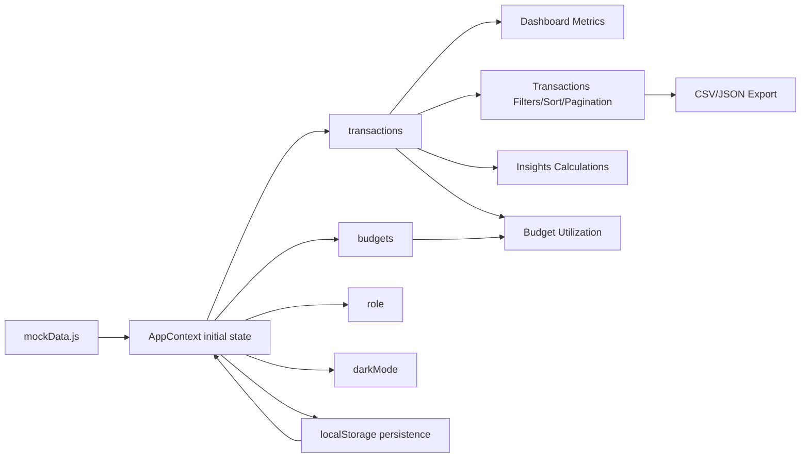
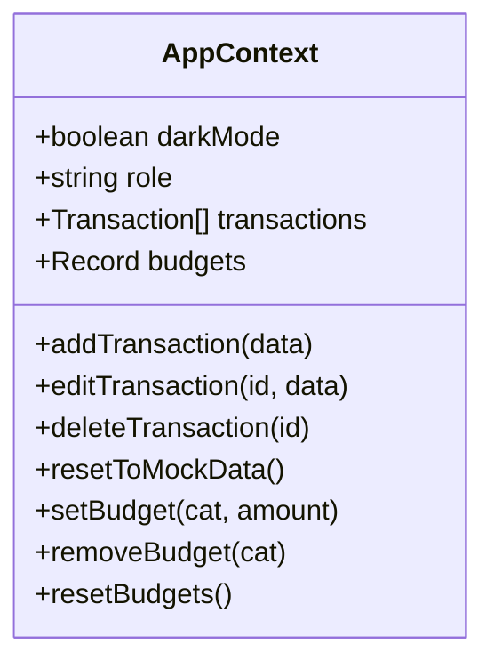

# FinTrack: Personal Finance Dashboard

FinTrack is a frontend finance dashboard application for tracking transactions, visualizing trends, managing budgets, and generating data-driven insights.

It runs fully on the client side using seeded transaction data and persists user changes in localStorage.

---

## Features

### Dashboard
- KPI summary cards (balance, income, expenses, savings trend)
- Balance trend chart
- Spending breakdown chart
- Recent transactions panel

### Transactions
- Search (description, merchant, category)
- Filters (type, category, date range)
- Sorting (date, description, category, type, amount)
- Pagination
- Admin-only add, edit, delete
- Export filtered data as CSV or JSON

### Insights
- Highest spending category
- Month-over-month spending comparison
- Contextual observation text generated from current data

### Budgets
- Per-category budget setup
- Budget progress and threshold alerts
- Edit/remove/reset budget controls

### UX
- Responsive layout (mobile/tablet/desktop)
- Dark mode with persistence
- Toast notifications for CRUD operations
- Role-based UI behavior (Admin / Viewer)

---

## Architecture

### High-Level Component Architecture



### Data Flow



### Route Map

```mermaid
graph TD
    R[/] --> D[Dashboard]
    R2[/transactions] --> T[Transactions]
    R3[/insights] --> I[Insights]
    R4[/budgets] --> B[Budgets]
    X[*] --> R
```

---

## Tech Stack

| Layer | Technology |
|---|---|
| Framework | React 18 + React Router |
| Build | react-scripts |
| Styling | Tailwind CSS + CSS variables |
| UI Primitives | Radix UI + shadcn-style components |
| Charts | Chart.js + react-chartjs-2 |
| Icons | Lucide React |
| State | React Context API |
| Persistence | localStorage |

---

## State Model

Global state lives in [src/context/AppContext.js](src/context/AppContext.js).



Persistence strategy:
- Initialize from localStorage when available
- Fall back to seeded defaults
- Persist each slice on update

---

## Project Structure

```text
public/
  index.html
  favicon.ico
  favicon.svg

src/
  App.js
  App.css
  index.js
  index.css
  chartSetup.js

  components/
    Layout.jsx
    Header.jsx
    Sidebar.jsx
    BrandLogo.jsx
    SummaryCards.jsx
    BalanceTrendChart.jsx
    SpendingBreakdownChart.jsx
    RecentTransactions.jsx
    TransactionsTable.jsx
    TransactionModal.jsx
    InsightsPanel.jsx
    ui/
      ...reusable UI primitives

  context/
    AppContext.js

  pages/
    DashboardPage.jsx
    TransactionsPage.jsx
    InsightsPage.jsx
    BudgetsPage.jsx

  data/
    mockData.js

  hooks/
    use-toast.js

  utils/
    finance.js
    pdfExport.js
```

---

## Getting Started

### Prerequisites
- Node.js 18+
- npm 9+ (or Yarn 1.22+)

### Install and Run

```bash
npm install
npm start
```

App URL: http://localhost:3000

### Production Build

```bash
npm run build
```

---

## Current Limitations

- Frontend-only persistence (no backend API)
- No auth service integration
- Export flow is browser-side only

## Next Improvements

- Add API-backed data and authentication
- Add automated unit/integration tests
- Add CI checks for lint/build/test
- Add advanced analytics (forecasting and anomaly detection)
